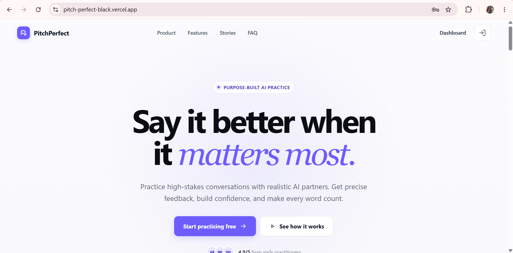
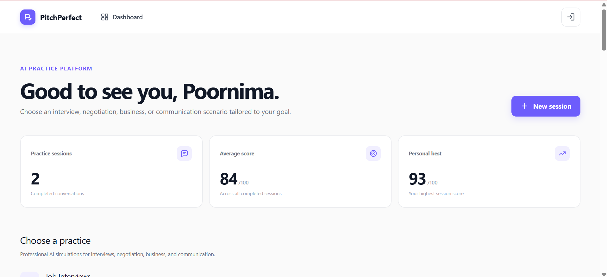
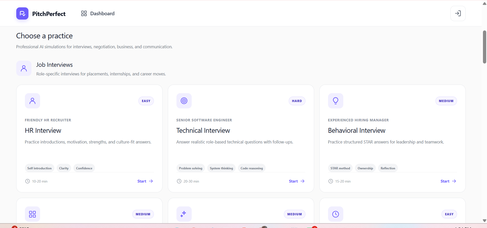
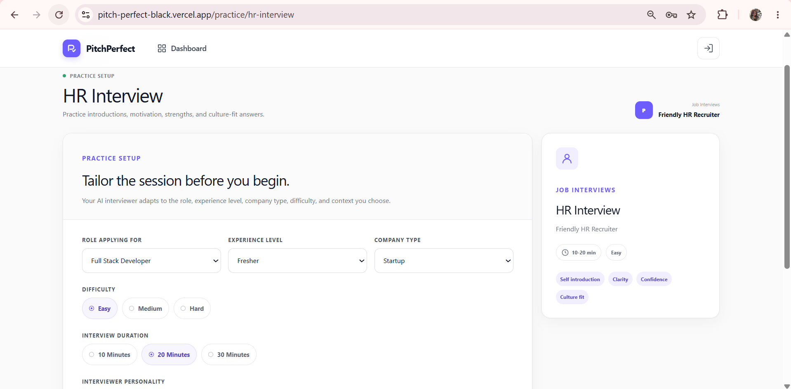
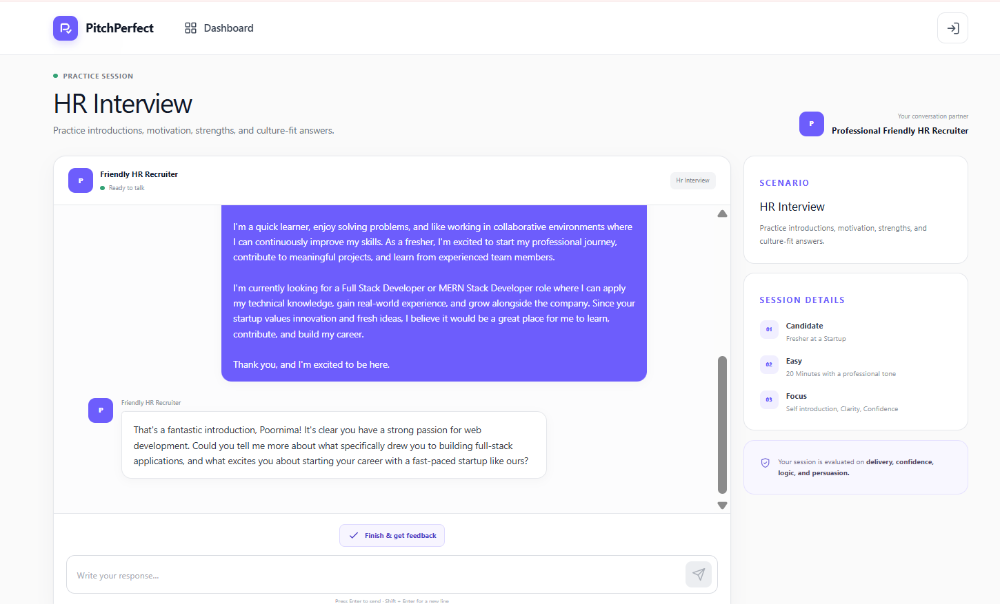
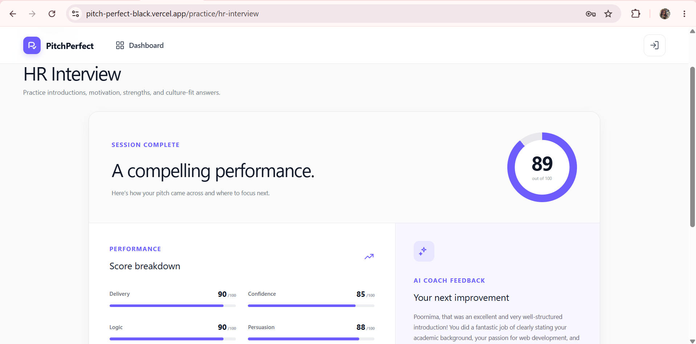

<div align="center">

# 🎯 PitchPerfect

### AI Interview & Communication Practice Platform

Practice interviews, salary negotiations, business pitches, and workplace communication with AI-powered simulations.

<p>
  <a href="https://pitch-perfect-black.vercel.app"><strong>🌐 Live Demo</strong></a> •
  <a href="https://github.com/poorrrnimaaa/PitchPerfect"><strong>💻 GitHub</strong></a> •
  <a href="https://pitchperfect-backend-mp87.onrender.com"><strong>⚙️ Backend API</strong></a>
</p>


</div>

---

# 📖 About

**PitchPerfect** is a full-stack AI-powered Interview & Communication Practice Platform that helps students, freshers, and professionals prepare for real-world interviews and workplace conversations.

The platform leverages **Google Gemini AI** to simulate realistic interview scenarios, evaluate user responses, and generate personalized feedback. Users can practice HR interviews, technical interviews, behavioral interviews, salary negotiations, business pitches, public speaking, and more in a safe environment before facing real interviews.

---

# ✨ Features

## 🔐 Authentication

- Secure User Registration & Login
- JWT Authentication
- Protected Routes
- Persistent User Sessions

---

## 🤖 AI Interview Engine

### 💼 Job Interviews

- HR Interview
- Technical Interview
- Behavioral Interview
- Manager Round
- Campus Placement
- Internship Interview

### 💰 Negotiation

- Salary Negotiation
- Offer Negotiation
- Promotion Discussion
- Freelance Client Negotiation
- Business Negotiation

### 🚀 Business

- Startup Pitch
- Investor Pitch
- Product Demo
- Fundraising
- VC Meeting

### 🗣 Communication

- Customer Support
- Public Speaking
- Presentation Practice
- Group Discussion
- College Viva

---

## ⚙️ Practice Setup

Customize every interview session with:

- 👨‍💻 Role Applying For
- 🎓 Experience Level
- 🏢 Company Type
- 📈 Difficulty Level
- ⏱ Interview Duration
- 🎭 Interviewer Personality
- 📝 Additional Context

---

## 📊 AI Feedback

Receive detailed AI-generated feedback including:

- Overall Performance Score
- Communication Skills
- Confidence Analysis
- Logic & Reasoning
- Professionalism
- Persuasion
- Personalized Suggestions
- Improvement Tips

---

## 📈 Dashboard

- Interview History
- Recent Sessions
- Performance Tracking
- Best Score
- Average Score

---

# 🖼 Screenshots

| Home | Dashboard |
|------|-----------|
|  |  |

| Practice Categories | Practice Setup |
|---------------------|----------------|
|  |  |

| AI Interview | AI Feedback |
|--------------|-------------|
|  |  |

---

# 🛠 Tech Stack

### Frontend

- React.js
- Vite
- React Router
- Axios
- Tailwind CSS
- CSS3

### Backend

- Node.js
- Express.js
- MongoDB Atlas
- Mongoose
- JWT Authentication
- Google Gemini AI

---

# 🧠 AI Personalization

PitchPerfect dynamically adapts interviews based on:

- Selected Scenario
- Role Applying For
- Experience Level
- Company Type
- Difficulty
- Interviewer Personality
- Additional Context

This creates realistic and personalized interview experiences rather than generic chatbot conversations.

---

# 📂 Project Structure

```text
PitchPerfect
│
├── backend/
├── frontend/
├── images/
├── shared/
├── README.md
└── .gitignore
```

---

# 🚀 Getting Started

## Clone Repository

```bash
git clone https://github.com/poorrrnimaaa/PitchPerfect.git
```

## Install Frontend

```bash
cd frontend
npm install
npm run dev
```

## Install Backend

```bash
cd backend
npm install
npm run dev
```

---

# 🔑 Environment Variables

Create `.env` files using the provided `.env.example` templates.

### Backend

Required variables:

```env
MONGO_URI=
JWT_SECRET=
GEMINI_API_KEY=
```

### Frontend

Required variables:

```env
VITE_API_URL=
```

---

# 🌐 Live Deployment

### 🚀 Frontend

https://pitch-perfect-black.vercel.app

### ⚙️ Backend

https://pitchperfect-backend-mp87.onrender.com

---

# 🎯 Future Improvements

- 🎙 Voice-Based Interviews
- 📄 Resume Analyzer
- 📋 Job Description Analyzer
- 🤖 AI Career Coach
- 💻 Coding Interview Mode
- 📈 Advanced Analytics
- 🏆 Achievements & Badges
- 📅 Interview Planner

---

# 👩‍💻 Developer

## Poornima

### GitHub

https://github.com/poorrrnimaaa

### LinkedIn

https://www.linkedin.com/in/poornima-b151a9253

---

# ⭐ Support

If you found this project useful, please consider giving it a ⭐ on GitHub.

It motivates me to continue building impactful AI-powered applications.

---

<div align="center">

## 🚀 Built with ❤️ using React, Node.js, Express, MongoDB & Google Gemini AI

**Thank you for visiting PitchPerfect!**

</div>
